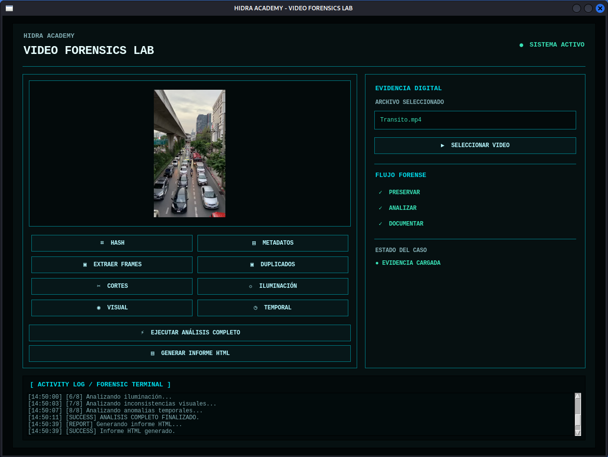

<!DOCTYPE html>
<html lang="es">
<head>
    <meta charset="UTF-8">
   <h1>ReconForense_video (version 1.0)</h1>
    Esta herramienta esta pensada para el análisis forense de videos, soportando los formatos a demanda. Tiene una interfaz interactiva que ayudara a la ejecución de las tareas como: 
 
* Análisis de autenticidad. 
* Detección de posibles manipulaciones. 
* Análisis cuadro por cuadro. 
* Identificación de frames duplicados 
* Extracción de fotogramas. 
* Análisis de artefactos. 
* Estabilización. 
* Corrección de iluminación. 
* Mejora de detalles.
* Detección visual de inconsistencias. 
* Comparación entre material original y procesado. 
* Superposición de video. 
* Comparación lado a lado. 
* Sustracción de cambios entre original y resultado. 
 
 
 
Recomendable que descargue el repositorio en la ruta /opt/

<strong>descargar el repositorio</strong>

<pre>sudo git clone https://github.com/Saifer10/ReconForense_Video.git</pre>
Por medio del archivo <strong>install_ReconForensics.sh</strong> se instalan las dependecias que requiere el programa

Permisos de ejecución para el archivo install_ReconForensic.sh:

<pre><code>chmod +x install_ReconForensic.sh</code></pre>

Ejecución del archivo install_ReconForensic.sh:

<pre><code>bash install_ReconForensic.sh</code></pre>
El archivo <strong>Install_ReconForensics</strong> debe instalar los siguientes dependencias 
 
    *  python3.  
    *  python3-venv. 
    *  python3-tk. 
    *  python3-opencv. 
    *  python3-numpy. 
    *  python3-pil. 
    *  ffmpeg. 
    *  ediainfo. 
    *  libimage-exiftool-perl. 
    *  hashdeep. 
 
Una vez instalado las dependencias se otorga permisos a el archivo python <strong>ReconForensic_GUI_v1.py</strong>
<pre><code> chmod +x ReconForensic_GUI_v1.py</code></pre>

<strong>Ejecución del archivo ReconForensic_GUI_v1.py</strong>:

<pre><code>Python3 ReconForensic_GUI_v1.py</code></pre>

</body>
</html>
